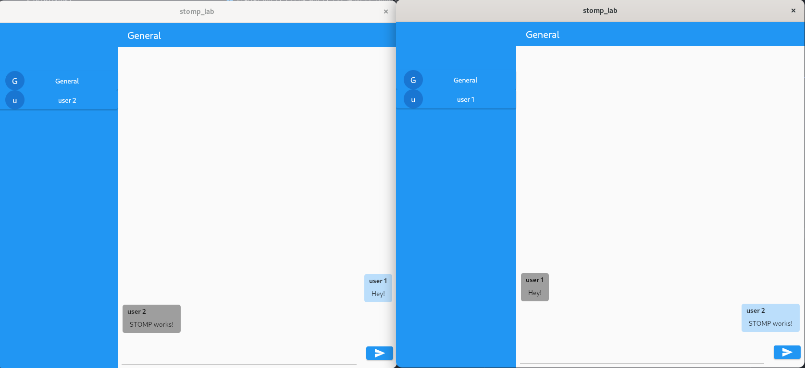

# Chat app

Example implement RabbitMQ and STOMP ([Paynal](https://pub.dev/packages/paynal)).

## Setup

#### Up a [RabbitMQ Docker](https://hub.docker.com/_/rabbitmq) instance.
- Start image and map ports: `docker run -it -p 15691:15691 -p 15692:15692 -p 25672:25672 -p 4369:4369 -p 5671:5671 -p 5672:5672 -p 15674:15674 -p 15672:15672 <RABBITMQ-IMAGE-ID>`
- [container] Enable STOMP over WebSockets: `rabbitmq-plugins enable rabbitmq_web_stomp`
- [container] (Optional) Enable RabbitMQ UIManager `rabbitmq-plugins enable rabbitmq_management`

## Run

> Require [Flutter](https://docs.flutter.dev/get-started/install)

- Run `flutter run`

## Screenshots

